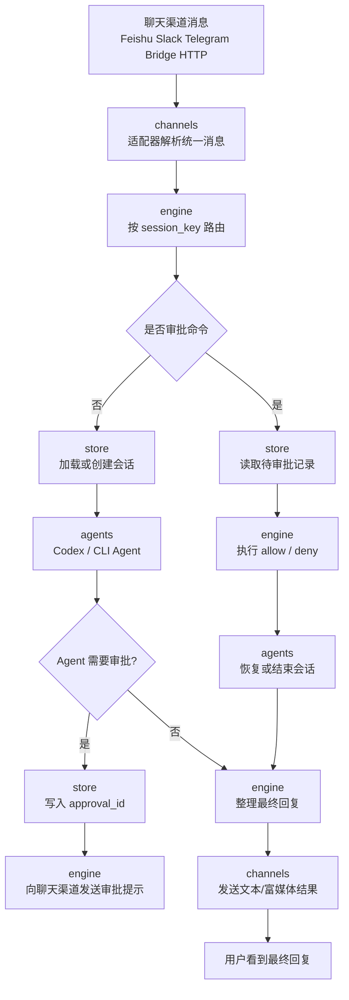
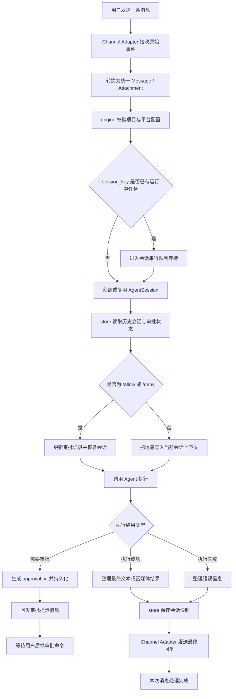
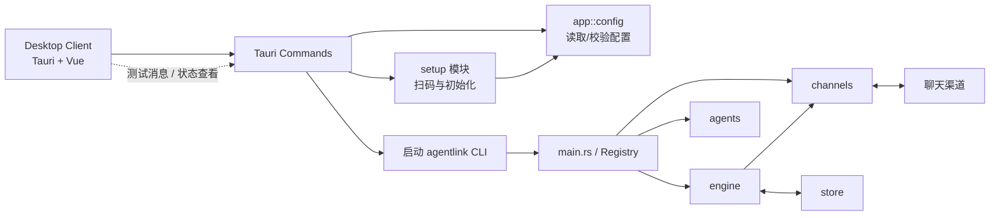

# AgentLink

<div align="center">

**🚀 连接任意聊天渠道到任意编程 Agent**

[](https://github.com/doit9816/AgentLink/actions)
[](LICENSE)
[](https://github.com/doit9816/AgentLink/releases)

[English](README.md) | 简体中文

</div>

AgentLink 是一个**高性能 Rust 桥接服务**，无缝连接聊天渠道与 AI 编程 Agent，让你在熟悉的聊天应用中实现自然语言编程工作流。

## ✨ 核心特性

### 🌐 全渠道聊天支持
原生适配 **15+ 聊天渠道**：
- **企业级**: 飞书/Lark (WebSocket 长连接)、钉钉、Slack (Socket Mode)、企业微信
- **社交渠道**: Telegram (长轮询)、Discord (Gateway)、LINE、微博
- **即时通讯**: 微信个人号 (iLink)、QQ/OneBot、QQ 官方 Bot、MAX
- **可扩展**: HTTP Webhook 和 WebSocket Bridge 支持自定义集成

### 🤖 多 Agent 架构
统一接口支持主流编程 Agent：
- **Codex** (exec 和 app-server 双模式)
- **Claude Code** / **Cursor** / **Gemini CLI**
- **OpenCode** / **Kimi** / **Qoder** / **iFlow**
- **通用 CLI 适配器**：支持任何命令行 Agent

### 🖥️ 精美桌面客户端
**Tauri 2.0 + Vue 3** 跨平台 GUI：
- 🎨 现代化响应式界面
- 🔐 扫码即用，快速接入飞书/Lark/微信
- ⚙️ 可视化配置编辑器，实时校验
- 🧪 内置消息测试，支持富媒体
- 📊 实时服务状态监控

### 🔄 自动化跨平台构建
**GitHub Actions 驱动的 CI/CD**：
- ✅ 每次推送到 `main` 自动构建
- 📦 平台专属安装包 (MSI、DMG、AppImage、DEB)
- 🏷️ 语义化版本标签发布
- 🔧 优化的图标配置，完美支持所有平台

### 🔒 生产级特性
- **会话管理**: SQLite 持久化会话存储
- **审批工作流**: 内置 `/allow` 和 `/deny` 命令
- **富媒体**: 图片、文件、音频、视频、位置、卡片
- **安全性**: Token 认证、签名校验
- **可靠性**: 消息队列、错误恢复、超时处理

## 🚀 快速开始

### 下载安装

从 [GitHub Releases](https://github.com/doit9816/AgentLink/releases) 下载最新版本：

**Windows**
```powershell
# 下载 .msi 或 .exe 安装包
# 或解压 .zip 直接运行 agentlink.exe
```

**macOS**
```bash
# 下载 .dmg 文件
# 拖动 AgentLink.app 到应用程序文件夹
```

**Linux**
```bash
# 下载 AppImage 或 DEB 包
chmod +x AgentLink-*.AppImage
./AgentLink-*.AppImage
```

### 首次运行

1. **启动桌面客户端**配置你的第一个聊天渠道
2. **扫描二维码**快速接入飞书/Lark/微信
3. **配置 Agent** (Codex、Claude Code 等)
4. **开始对话**，享受 AI 编程助手！

## 🏗️ 架构设计

```
┌─────────────────────────────────────────────────────────────┐
│                      聊天渠道层                              │
│  飞书 │ Slack │ Telegram │ Discord │ 微信 │ QQ │ ...       │
└────────────────────┬────────────────────────────────────────┘
                     │
                     ▼
┌─────────────────────────────────────────────────────────────┐
│                    渠道适配器层                              │
│         (原生 WebSocket/HTTP/长轮询实现)                     │
└────────────────────┬────────────────────────────────────────┘
                     │
                     ▼
┌─────────────────────────────────────────────────────────────┐
│                  AgentLink 引擎层                            │
│  • 会话管理        • 消息路由                                │
│  • 审批工作流      • 富媒体处理                              │
└────────────────────┬────────────────────────────────────────┘
                     │
                     ▼
┌─────────────────────────────────────────────────────────────┐
│                   Agent 适配器层                             │
│    Codex │ Claude Code │ Gemini │ Cursor │ 通用 CLI         │
└─────────────────────────────────────────────────────────────┘
```

## 🎯 应用场景

- **团队协作**: 让团队通过熟悉的聊天应用与 AI Agent 交互
- **代码审查**: 在 Slack/Discord 频道中获得即时代码建议和审查
- **DevOps 自动化**: 通过聊天命令触发部署和基础设施变更
- **学习入门**: 为新开发者提供交互式编程辅导
- **多渠道触达**: 在用户偏好的消息渠道上提供服务

## 📚 文档目录

AgentLink 是一个 Rust 独立桥接服务，用来把飞书、钉钉、微信、Telegram 等聊天渠道连接到 Codex、Claude Code、Gemini、OpenCode 等编程 Agent。

核心链路：

```text
Channel -> Engine -> AgentSession -> 编程 Agent CLI / app-server
```

## 交互流程图

### 1. 总体交互



### 2. 单条消息处理



### 3. Desktop Client 与核心链路关系



可以把它理解成两条并行关系：

- `client` 负责配置、setup、状态查看、启动/停止本地 `agentlink` 进程，以及少量测试能力。
- 真正处理聊天消息的是 `agentlink` CLI 进程内部的 `channels -> engine -> agents -> store` 主链路。

也就是说，桌面端不是消息转发必经层；它更像本地控制面板。即使没有 `client`，只要配置文件准备好，直接运行 `agentlink run --config ...`，消息链路也能独立工作。

v1 已完成：

- 多编程 Agent 架构，Codex 是第一个真实 Agent。
- Agent 注册矩阵：`codex`、`mock`，以及通用 CLI 适配的 `claudecode`、`claude-code`、`cursor`、`gemini`、`kimi`、`qoder`、`opencode`、`iflow`、`pi`、`devin`、`acp`。
- `Platform / Agent / AgentSession / Engine / SessionStore` 分层。
- 内置 `MockPlatform + MockAgent`，保证 e2e 不依赖真实 IM。
- `BridgePlatform`：WebSocket 外部适配器接入。
- `HttpPlatform`：HTTP webhook/outbox 参考通道。
- 原生 `feishu` / `lark` 文本平台，默认使用 WebSocket 长连接，不需要公网 IP。
- 原生 `dingtalk` 文本 webhook 平台。
- 原生 `telegram` long polling 文本平台，不需要公网 IP。
- 原生 `slack` Socket Mode 文本平台，不需要公网 IP。
- 原生 `discord` Gateway 文本平台，不需要公网 IP。
- 原生 `qq` OneBot v11 正向 WebSocket 文本平台，不需要公网 IP。
- 原生 `line` webhook 文本平台。
- 原生 `wecom` 企业微信 webhook 文本平台。
- 原生 `max` long polling 文本平台。
- 原生 `weixin` OpenClaw/iLink 长轮询文本平台。
- 原生 `qqbot` QQ 官方 Bot Gateway 文本平台。
- 原生 `weibo` WebSocket 文本平台。
- Codex app-server stdio 适配骨架。
- SQLite 会话和审批存储。
- 同一会话普通消息串行处理，审批命令旁路处理。
- 文字审批协议：`/allow <approval_id>`、`/deny <approval_id>`。
- 默认只发送最终结果，不做流式消息编辑。
- 统一富媒体消息结构：图片、文件、音频、视频、位置、卡片、贴纸、raw 事件先在 HTTP/Bridge/Engine/Codex 主链路打通。
- Tauri 桌面客户端骨架，可做 setup、校验配置、启动/停止 AgentLink、发送 HTTP 测试消息。

文档入口：

- [English README](README.md)
- [Bridge WebSocket 协议](docs/agentlink-protocol.zh-CN.md)
- [桌面端说明](client/agentlink-desktop/README.md)

## 代码目录

最近已经从早期的 `src/*.rs` 平铺结构，重构为按职责分层的模块目录：

```text
src/
  agents/            Codex 与通用 CLI Agent 预设
  app/               配置加载、运行时注册表
  channels/          原生聊天渠道与 Bridge/HTTP 适配器
  core/              公共 trait、消息、审批、会话类型
  engine/            路由、串行会话、审批流、最终结果输出
  setup/             setup 命令与飞书/Lark 初始化辅助
  store/             SQLite SessionStore
  testing/           MockPlatform / MockAgent 与测试辅助
  lib.rs             对外导出与兼容 re-export
  main.rs            CLI 入口与默认 Registry 装配
client/              Tauri 桌面客户端
docs/                协议与补充说明
```

当前模块边界可以这样理解：

- `core` 负责定义协议和抽象。
- `engine` 负责编排消息生命周期。
- `channels` 负责把真实聊天渠道翻译成统一事件。
- `agents` 负责把统一请求翻译给 Codex、Claude Code、Gemini 等 Agent。
- `app` 负责把配置、Registry、CLI 运行时接起来。
- `setup` 与 `testing` 分别承接初始化和测试场景，避免核心链路继续堆在入口文件里。

兼容性上，`src/lib.rs` 仍然保留了主要 re-export，所以旧 import 在一段时间内还能继续工作，但新增代码建议直接使用新的命名空间路径。

## 📦 打包与发布

### 本地打包

**Windows 一键打包**
```powershell
powershell -NoProfile -ExecutionPolicy Bypass -File .\scripts\auto-package.ps1
```

这个脚本会：
- ✅ 运行所有测试
- 🔨 Release 模式构建核心桥接服务
- 🖥️ 构建 Tauri 桌面客户端
- 📦 生成平台安装包 (MSI、NSIS)
- 🗜️ 创建发布归档文件

**macOS/Linux 打包**
```bash
bash ./scripts/package-unix.sh <version> <target-name>
```

### GitHub Actions 自动发布

我们的 CI/CD 流水线会自动构建和发布：

**推送到 `main` 分支时**
- 触发 Windows、macOS、Linux 三平台构建
- 更新 `latest` 预发布标签
- 上传所有平台产物

**推送版本标签 (`v*`) 时**
```bash
git tag v0.2.0
git push origin v0.2.0
```
- 创建正式发布版本
- 生成发布说明
- 发布系统专属安装包：
  - **Windows**: `.zip`、`.msi`、`.exe` (NSIS)
  - **macOS**: `.tar.gz`、`.dmg`
  - **Linux**: `.tar.gz`、`.AppImage`、`.deb`

### 发布产物

每个发布版本包含：
- 📦 **核心桥接服务**: 独立 CLI 可执行文件
- 🖥️ **桌面客户端**: 系统专属安装包
- 📄 **文档**: README 和示例配置
- 🔧 **配置模板**: 示例 TOML 文件

### 构建优化亮点

我们最近修复了跨系统构建问题，现在支持：
- ✅ **统一图标配置**: 符合 Tauri 2.0 规范，支持所有系统
- ✅ **系统特定构建**: macOS 使用 DMG，Linux 使用标准 bundle
- ✅ **并行构建**: 三系统同时构建，加快发布速度
- ✅ **自动化测试**: 每次构建前运行完整测试套件

## 🛠️ 开发指南

### 环境要求
- Rust 1.70+
- Node.js 18+
- 平台特定依赖（见下文）

### 从源码构建

```bash
# 克隆仓库
git clone https://github.com/doit9816/AgentLink.git
cd AgentLink

# 构建核心桥接服务
cargo build --release

# 构建桌面客户端
cd client/agentlink-desktop
npm install
npm run build

# 可执行文件位于 target/release/
```

### 平台特定依赖

**Linux**
```bash
sudo apt-get install -y \
  libwebkit2gtk-4.1-dev \
  build-essential \
  libssl-dev \
  libayatana-appindicator3-dev \
  librsvg2-dev \
  patchelf
```

**macOS**
```bash
# 需要 Xcode 命令行工具
xcode-select --install
```

**Windows**
```powershell
# 需要 Visual Studio Build Tools 或 MSVC
# WebView2 运行时 (Windows 10/11 通常已预装)
```

## 客户端构建脚本

Windows 下建议使用脚本构建 Tauri 客户端，脚本会固定使用 Node.js 18+、先构建 Vue，再构建 Tauri release，并可选重新打包。

```powershell
cd /path/to/agentlink
powershell -ExecutionPolicy Bypass -File .\scripts\build-client.ps1 -SkipInstall -Launch
```

常用参数：

- `-NodeDir /path/to/nodejs`：指定 Node.js 18+ 目录。
- `-CargoTargetDir /path/to/desktop-target`：指定客户端 Rust 构建目录，避免污染主工程 target。
- `-BridgeCargoTargetDir /path/to/bridge-target`：指定 AgentLink 主程序打包构建目录，避免磁盘空间不足。
- `-SkipInstall`：已有 `node_modules` 时跳过 `npm ci`。
- `-SkipTests`：跳过 Tauri `cargo check`。
- `-SkipPackage`：只构建客户端，不重新生成 dist zip。
- `-Launch`：构建完成后直接启动客户端。

## 自动打包

本地一键打包推荐使用 `scripts/auto-package.ps1`。它会依次完成核心程序测试与 release build、Tauri 桌面端构建、安装包收集、`dist` zip 生成。

```powershell
cd /path/to/agentlink
powershell -NoProfile -ExecutionPolicy Bypass -File .\scripts\auto-package.ps1
```

常用参数：

- `-SkipTests`：跳过 Rust 测试和 Tauri `cargo check`。
- `-SkipInstall`：跳过桌面端 `npm ci`，适合本机已有 `node_modules`。
- `-SkipDesktop`：只构建核心 `agentlink.exe` 和 zip。
- `-SkipArchive`：只做构建，不生成 `dist` zip。
- `-CoreTargetDir /path/to/core-target`：指定核心程序构建目录。
- `-DesktopTargetDir /path/to/desktop-target`：指定桌面端构建目录。

推送版本标签或手动触发后，`.github/workflows/release.yml` 会构建 Windows、macOS、Linux 产物。

- 手动触发：执行跨平台桌面构建，但不更新公开升级源。
- 推 `v0.1.0` 这类 tag：自动发布对应正式 Release，并上传各平台归档和桌面安装包。
- 推 `v0.1.0` 这类 tag 时，桌面端 updater 还会把各平台公开升级源推送到 `updater-feed` 分支：
  - `https://raw.githubusercontent.com/doit9816/AgentLink/updater-feed/windows/x86_64/latest.json`
  - `https://raw.githubusercontent.com/doit9816/AgentLink/updater-feed/linux/x86_64/latest.json`
  - `https://raw.githubusercontent.com/doit9816/AgentLink/updater-feed/darwin/x86_64/latest.json`
  - `https://raw.githubusercontent.com/doit9816/AgentLink/updater-feed/darwin/aarch64/latest.json`

当前本地一键打包脚本 `scripts/auto-package.ps1` 仍然是 Windows 优先；`macOS/Linux` 的自动构建现在由 GitHub Actions 负责。

桌面端“软件更新”现在使用 `updater-feed` 分支上的公开静态升级源，不再依赖 GitHub `releases/latest/download/latest.json`：

```text
https://raw.githubusercontent.com/doit9816/AgentLink/updater-feed/{{target}}/{{arch}}/latest.json
```

维护发布时需要同时满足：

- GitHub Actions secrets 中配置 `TAURI_SIGNING_PRIVATE_KEY` 和 `TAURI_SIGNING_PRIVATE_KEY_PASSWORD`
- 仓库保持公开可访问，以便客户端读取 `raw.githubusercontent.com` 上的升级源
- `scripts/stage-updater-feed.ps1` 成功把各平台的 `latest.json`、安装包或归档以及 `.sig` 整理到公开 feed 目录

发布正式版本示例：

```powershell
git tag v0.1.0
git push origin v0.1.0
```

## 多 Agent 接入

本项目现在注册了这些 Agent 类型：

```text
mock
codex
cli
claudecode / claude-code / claude
cursor / cursor-agent
gemini / gemini-cli
kimi / kimi-cli
qoder / qoder-cli
opencode
iflow / iflow-cli
pi
devin
acp
```

其中 `codex` 默认走 `codex exec --json`，并保留 Codex app-server 后端；其他类型先走通用 CLI Agent 适配器。CLI Agent 会按配置启动外部命令，把用户消息传给命令，再把 stdout/JSON stream 中提取到的结果回给聊天通道。

示例：

```toml
[projects.agent]
type = "gemini"

[projects.agent.options]
work_dir = "/path/to/your/project"
command = "gemini"
args = ["-p", "--output-format", "stream-json"]
prompt_stdin = true
timeout_mins = 30
```

通用配置项：

- `command` / `cmd` / `cli_path`：CLI 可执行文件。
- `args`：命令参数，支持 `{prompt}`、`{session_id}`、`{model}`、`{mode}` 占位符。
- `prompt_stdin = true`：把 prompt 写到 stdin。
- `append_prompt = true`：把 prompt 追加到参数末尾。
- `work_dir`：工作目录。
- `model`、`mode`：可用于参数占位。
- `[projects.agent.options.env]`：注入环境变量。

示例文件：

```text
examples/agentlink.agents.toml
```

当前边界：Claude Code、Gemini、OpenCode、Kimi、Qoder、iFlow、Cursor、Pi 这类已经能通过 CLI 命令接入；Devin/ACP 也有注册入口和配置形态，但完整 ACP JSON-RPC 会话协议还没有深度实现，当前作为命令/stdio 适配入口使用。

## Codex 后端

`codex` Agent 现在支持两种后端：

- `backend = "exec"`：默认值，启动 `codex exec --json`；首次消息创建线程，后续自动使用 `codex exec resume <thread_id>` 续聊。它更适合本地直接接聊天渠道，不需要额外启动 Codex app-server。
- `backend = "app-server"`：保留原先的 `codex app-server --listen stdio://` 接入方式，适合需要交互式审批回调的场景。

常用配置：

```toml
[projects.agent]
type = "codex"

[projects.agent.options]
work_dir = "/path/to/your/project"
backend = "exec"
codex_bin = "codex"
mode = "suggest"              # suggest / auto-edit / full-auto / yolo
model = "gpt-5.2"
reasoning_effort = "medium"
timeout_mins = 30
# codex_home = "D:/codex-home"
# cli_path = "codex --profile work"
# base_url = "https://api.openai.com/v1"
# model_provider = "openai"
```

`mode` 支持：`suggest` 不额外放权，`auto-edit/full-auto` 会追加 `--full-auto`，`yolo` 会追加 `--dangerously-bypass-approvals-and-sandbox`。聊天桥默认仍然只把最终结果发回渠道；工具进度事件会保留在内部事件流里，后续客户端可以展示。

## 富媒体消息

HTTP 和 Bridge 通道现在都支持统一的 `message_type` 与 `attachments`：

```json
{
  "session_key": "chat:user",
  "user_id": "user-1",
  "message_type": "mixed",
  "content": "帮我看这条消息",
  "attachments": [
    {
      "kind": "location",
      "text": "office",
      "metadata": { "lat": 31.2, "lng": 121.5 }
    },
    {
      "kind": "image",
      "mime_type": "image/png",
      "data": "base64..."
    }
  ]
}
```

支持的 `message_type`：`text`、`image`、`file`、`audio`、`video`、`location`、`card`、`sticker`、`mixed`、`event`、`raw`。

支持的 `attachments.kind`：`image`、`file`、`audio`、`video`、`location`、`card`、`sticker`、`raw`。

当前真实 IM 平台的高级媒体发送仍按平台逐步补齐；v1 会把富媒体摘要注入 Agent 上下文，图片/文件在 Codex 能力允许时以本地附件路径传入。

## Tauri 客户端

客户端目录：

```text
client/agentlink-desktop
```

开发运行：

```powershell
cd client\agentlink-desktop
npm install
npm run dev
```

客户端可以：

- 调用 `setup --platform ...` 完成扫码/交互式初始化。
- 校验 `agentlink.all.toml`。
- 启动/停止 AgentLink 服务。
- 向 HTTP webhook 发送 text/image/file/audio/video/location/card/sticker/raw 测试消息。

Tauri v2 使用前端 `invoke()` 调 Rust command，权限通过 capabilities 控制；本客户端按 Tauri v2 的 capabilities 目录结构放在 `src-tauri/capabilities/default.json`。

## 统一配置与通道选择

推荐把所有聊天通道放到一个配置文件里，例如：

```powershell
cargo run -- --config examples/agentlink.all.toml
```

`agentlink.all.toml` 里每个通道都有一个 `id`，项目上可以用 `default_platforms` 指定默认启动哪些通道：

```toml
[[projects]]
name = "demo"
default_platforms = ["feishu"]

[[projects.platforms]]
id = "feishu"
type = "feishu"
```

启动时也可以不改配置，直接用命令行覆盖默认通道：

```powershell
cargo run -- --config examples/agentlink.all.toml --platform feishu
cargo run -- --config examples/agentlink.all.toml --channel dingtalk
cargo run -- --config examples/agentlink.all.toml --platform feishu,dingtalk
cargo run -- --config examples/agentlink.all.toml --project demo --platform qqbot
```

`--platform` / `--channel` 可以匹配三个值：

- `projects.platforms.id`
- `projects.platforms.options.name`
- `projects.platforms.type`

为了兼容老配置，如果没有写 `default_platforms`，默认会启动该项目下的全部 `platforms`。

## 扫码优先 Setup

首次接入通道时，优先使用统一 setup 命令：

```powershell
# 真正由 bridge 打印二维码、扫码后自动写 app_id/app_secret
agentlink setup --platform feishu --config examples/agentlink.all.toml --project demo --work-dir /path/to/your/project

# Lark 同理
agentlink setup --platform lark --config examples/agentlink.all.toml --project demo --work-dir /path/to/your/project

# QQ 个人号：二维码登录发生在 NapCat/LLOneBot，bridge 自动写 OneBot 接入配置
agentlink setup --platform qq --config examples/agentlink.all.toml --project demo --ws-url ws://127.0.0.1:3001

# 微信个人号：二维码登录发生在 OpenClaw/iLink 兼容网关，bridge 自动写配置骨架
agentlink setup --platform weixin --config examples/agentlink.all.toml --project demo --token <gateway-token>

# 查看支持矩阵
agentlink setup --platform all
```

扫码/交互式 setup 成功后，会把对应通道写入项目的 `default_platforms`，后续可以直接：

```powershell
agentlink --config examples/agentlink.all.toml
```

目前支持情况：

- `feishu` / `lark`：支持 AgentLink 内置二维码 onboarding，扫码后自动写配置。
- `qq`：支持外部扫码。扫码由 NapCat/LLOneBot 完成，AgentLink 写入 OneBot WebSocket 配置。
- `weixin`：支持外部扫码。扫码由 OpenClaw/iLink 兼容网关完成，AgentLink 写入配置骨架。
- `dingtalk` / `telegram` / `slack` / `discord` / `line` / `wecom` / `max` / `qqbot` / `weibo`：平台 Bot 接入模型本身是 token、app secret 或开放平台配置，不支持 AgentLink 内置扫码。

飞书/Lark 推荐使用 `connection_mode = "websocket"`。这种模式由 bridge 主动连飞书开放平台，不需要监听本地端口，也不需要公网回调地址。只有使用 `connection_mode = "webhook"` 时，才需要 `listen` 和 `callback_path`，并且飞书后台配置的回调 URL 要能访问到这个 HTTP 服务。

## Bridge WebSocket 通道

Bridge 通道用于让外部聊天渠道适配器动态接入。它的模型如下：

```text
聊天渠道 Adapter <-> Bridge WebSocket <-> Engine <-> Agent
```

运行：

```powershell
cargo run -- --config examples/agentlink.ws.toml
```

外部适配器连接：

```text
ws://127.0.0.1:9810/bridge/ws?token=change-me
```

先发送注册消息：

```json
{
  "type": "register",
  "platform": "wechat",
  "capabilities": ["text"]
}
```

再发送用户消息：

```json
{
  "type": "message",
  "msg_id": "msg-001",
  "session_key": "wechat:room-1:user-1",
  "user_id": "user-1",
  "user_name": "Alice",
  "content": "帮我看下这个项目",
  "reply_ctx": "opaque-channel-context"
}
```

Bridge 会把 Agent 最终结果推回：

```json
{
  "type": "reply",
  "session_key": "wechat:room-1:user-1",
  "reply_ctx": "opaque-channel-context",
  "content": "最终回复内容",
  "format": "text"
}
```

完整协议见：

```text
docs/agentlink-protocol.zh-CN.md
```

本地控制台适配器示例：

```powershell
$env:BRIDGE_URL = "ws://127.0.0.1:9810/bridge/ws?token=change-me"
cargo run --example agentlink_adapter
```

## HTTP 参考通道

`HttpPlatform` 用来示范 webhook 型聊天渠道该如何接入：

- 入站：`POST /webhook`
- 健康检查：`GET /healthz`
- 调试出站消息：`GET /outbox`
- 可选鉴权：`Authorization: Bearer <bearer_token>`
- 可选出站转发：配置 `outbound_url` 后，`send/reply` 会 POST 到外部发送接口

运行：

```powershell
cargo run -- --config examples/agentlink.http.toml
```

## 原生飞书/钉钉

飞书扫码/凭证 setup 也可以使用兼容旧入口：

```powershell
# 没有应用凭证：走二维码 onboarding
agentlink feishu setup --config agentlink.toml --project demo

# 直接写入统一配置，扫码成功后会自动写入 app_id/app_secret、platform id 和 default_platforms
agentlink feishu setup --config examples/agentlink.all.toml --project demo --work-dir /path/to/your/project

# 已有应用凭证：校验并写入配置
agentlink feishu setup --config agentlink.toml --project demo --app cli_xxx:sec_xxx

# 强制绑定已有凭证
agentlink feishu bind --config agentlink.toml --project demo --app-id cli_xxx --app-secret sec_xxx
```

`setup` 会创建或更新配置里的 `[[projects]]` 与 `feishu/lark` platform。没有 `--app` 时，会在终端打印飞书/Lark 扫码 URL 和二维码；扫码成功后会自动写入 `app_id`、`app_secret`，并把飞书通道加入该项目的 `default_platforms`。写入的飞书配置默认是：

```toml
connection_mode = "websocket"
```

也就是启动后主动连飞书开放平台长连接，正常情况下不需要公网 IP、域名、HTTPS 或 webhook 回调地址。

飞书：

```powershell
cargo run -- --config examples/agentlink.feishu.toml
```

飞书开放平台里需要启用机器人能力，并在「事件与回调」里选择「使用长连接接收事件」，订阅：

```text
im.message.receive_v1
```

当前支持：

- WebSocket 长连接接收 `im.message.receive_v1` 文本消息。
- webhook fallback 的 `url_verification` 与文本消息。
- 使用 `message_id` 调飞书 reply API 回复文本

如果你明确想用 webhook 模式，可以在飞书 platform options 里设置：

```toml
connection_mode = "webhook"
listen = "127.0.0.1:18200"
callback_path = "/feishu/webhook"
```

然后配置飞书事件订阅回调地址：

```text
http://<你的服务地址>:18200/feishu/webhook
```

钉钉：

```powershell
cargo run -- --config examples/agentlink.dingtalk.toml
```

配置钉钉回调地址：

```text
http://<你的服务地址>:18300/dingtalk/webhook
```

当前支持：

- 文本消息 payload
- 使用回调里的 `sessionWebhook` 回复 markdown 文本

说明：这两个原生平台先按 text-only 实现，已经接入统一的 Platform 分层、session key、reply context 和回复链路。飞书/Lark 已支持长连接；飞书加密 webhook 事件、钉钉 Stream 长连接、图片/文件/卡片可在下一版继续补。

## Telegram / Slack / Discord

这三个通道都按“平台主动连接/轮询”方式实现，默认不需要公网回调：

Telegram：

```powershell
cargo run -- --config examples/agentlink.telegram.toml
```

需要 BotFather 创建 bot，把 token 写到：

```toml
token = "123456:your-telegram-bot-token"
```

Slack：

```powershell
cargo run -- --config examples/agentlink.slack.toml
```

需要 Slack App 开启 Socket Mode，配置 `app_token = "xapp-..."` 和 `bot_token = "xoxb-..."`，订阅 message/app mention 事件，并把 bot 加入频道。

Discord：

```powershell
cargo run -- --config examples/agentlink.discord.toml
```

需要 Discord Bot token，并在 Developer Portal 开启 Message Content Intent。把 bot 邀请到服务器后，消息会通过 Gateway 进入 bridge。

当前这三个平台都先支持 text-only：

- 收普通文本消息。
- 生成 `session_key`，默认按 `platform:channel:user` 隔离会话。
- 最终回复发送回原频道/线程。
- `share_session_in_channel = true` 可改成同频道共享一个 Agent 会话。

## QQ / OneBot

QQ 通道使用 OneBot v11 正向 WebSocket 模式，适合配合 NapCat、LLOneBot 等本地 OneBot 实现：

```powershell
cargo run -- --config examples/agentlink.qq.toml
```

默认连接：

```toml
ws_url = "ws://127.0.0.1:3001"
```

当前支持 text-only：

- 接收 OneBot `post_type = "message"` 的私聊/群聊文本。
- 群聊默认按 `qq:<group_id>:<user_id>` 隔离会话。
- 私聊按 `qq:<user_id>` 复用会话。
- 回复走 `send_group_msg` / `send_private_msg`。

## 其他原生通道

这一批先按 text-only v1 落地，配置文件都在 `examples/` 下：

```powershell
cargo run -- --config examples/agentlink.line.toml
cargo run -- --config examples/agentlink.wecom.toml
cargo run -- --config examples/agentlink.max.toml
cargo run -- --config examples/agentlink.weixin.toml
cargo run -- --config examples/agentlink.qqbot.toml
cargo run -- --config examples/agentlink.weibo.toml
```

支持范围：

- Line：webhook 收文本，push message 回文本，支持 `X-Line-Signature` 校验。
- 企业微信：webhook 收文本，客服/应用消息 send API 回文本；支持 JSON/plain XML 测试入口，也支持企业微信加密 XML 的 SHA1 验签与 AES-CBC 解密。
- MAX：支持 `GET /updates` 长轮询，也支持 webhook 订阅模式；回包走 `POST /messages`。
- 微信个人号：参考 OpenClaw/iLink，`ilink/bot/getupdates` 长轮询收文本，`sendmessage` 回文本。
- QQBot：Gateway WebSocket 收文本，支持 app_id/app_secret 拉取 access_token，HTTP 消息接口回文本。
- Weibo：WebSocket 收文本，支持 app_id/app_secret 拉取 ws token，HTTP 消息接口回文本。

这些通道已经接入统一 `Platform -> Engine -> AgentSession` 链路。当前重点跑通文本消息、会话路由、审批指令和最终回复；图片、文件、卡片、QQBot 富媒体菜单等高级能力后续可继续按同一 `Platform` 接口扩展。

## 配置示例

```text
examples/agentlink.mock.toml   Mock e2e
examples/agentlink.all.toml    单文件多通道总配置，可用 --platform/--channel 选择通道
examples/agentlink.codex.toml  Codex + MockPlatform
examples/agentlink.http.toml   HTTP 参考通道
examples/agentlink.ws.toml     Bridge WebSocket 通道
examples/agentlink.feishu.toml 飞书原生通道
examples/agentlink.dingtalk.toml 钉钉原生通道
examples/agentlink.telegram.toml Telegram 原生通道
examples/agentlink.slack.toml Slack 原生通道
examples/agentlink.discord.toml Discord 原生通道
examples/agentlink.qq.toml QQ/OneBot 原生通道
examples/agentlink.line.toml Line 原生通道
examples/agentlink.wecom.toml 企业微信原生通道
examples/agentlink.max.toml MAX 原生通道
examples/agentlink.weixin.toml 微信个人号 OpenClaw/iLink 通道
examples/agentlink.qqbot.toml QQ 官方 Bot 通道
examples/agentlink.weibo.toml Weibo 原生通道
```

## 测试

```powershell
cd tools/agentlink
cargo test
```

测试覆盖：

- 注册表未知 Agent/Platform 报错。
- SQLite 会话恢复。
- 审批命令解析。
- `MockPlatform + MockAgent` e2e。
- `HttpPlatform + MockAgent` webhook/outbox e2e。
- `BridgePlatform + MockAgent` WebSocket register/message/reply e2e。
- `FeishuPlatform + MockAgent` webhook 和 WebSocket 长连接 e2e。
- `TelegramPlatform + MockAgent` long polling e2e。
- `SlackPlatform + MockAgent` Socket Mode e2e。
- `DiscordPlatform + MockAgent` Gateway e2e。
- `QqPlatform + MockAgent` OneBot WebSocket e2e。
- Line / 企业微信 / MAX / 微信个人号 / QQBot / Weibo text-only e2e。
- Bridge token 鉴权。

## 构建

```powershell
cargo build --release
```

生成文件：

```text
target/release/agentlink.exe
```

## 打包

```powershell
.\scripts\package.ps1
```

如果 D 盘空间不足，可以把构建目录放到 C 盘临时目录：

```powershell
$env:CARGO_TARGET_DIR = "$env:TEMP\agentlink-target"
.\scripts\package.ps1
```

默认会运行测试、release build，并生成：

```text
dist/agentlink-v0.1.0-windows-amd64.zip
```

如果已经用 `scripts/auto-package.ps1` 构建过桌面客户端，zip 内还会包含 `desktop/` 目录，里面有桌面 exe 和可用的安装包目录。

## 🤝 贡献指南

我们欢迎各种形式的贡献！

1. 🐛 **报告 Bug**: 提交 issue 并附上复现步骤
2. 💡 **建议功能**: 在 discussions 中分享你的想法
3. 🔧 **提交 PR**: 修复 bug 或添加新功能
4. 📖 **改进文档**: 帮助其他人更好地理解 AgentLink
5. 🌍 **添加渠道**: 为新的聊天渠道实现适配器

### 开发流程

1. Fork 本仓库
2. 创建特性分支 (`git checkout -b feature/AmazingFeature`)
3. 提交更改 (`git commit -m 'Add some AmazingFeature'`)
4. 推送到分支 (`git push origin feature/AmazingFeature`)
5. 开启 Pull Request

## 📊 项目状态

- ✅ **核心引擎**: 稳定
- ✅ **桌面客户端**: 稳定 (Tauri 2.0)
- ✅ **CI/CD 流水线**: 完全自动化
- ✅ **15+ 聊天渠道**: 生产就绪
- 🚧 **富媒体**: 持续扩展渠道支持
- 🚧 **移动客户端**: 规划中

## 🙏 致谢

基于优秀的开源技术构建：
- [Rust](https://www.rust-lang.org/) - 系统编程语言
- [Tauri](https://tauri.app/) - 桌面应用框架
- [Vue 3](https://vuejs.org/) - 渐进式 JavaScript 框架
- [Tokio](https://tokio.rs/) - Rust 异步运行时

## 📄 许可证

本项目采用 MIT 许可证 - 详见 [LICENSE](LICENSE) 文件

---

<div align="center">

**⭐ 如果 AgentLink 对你有帮助，请在 GitHub 上给我们一个 Star！**

[报告 Bug](https://github.com/doit9816/AgentLink/issues) · [功能建议](https://github.com/doit9816/AgentLink/issues) · [English Docs](README.md)

</div>

---

## 附录：详细功能说明

## 命令

```powershell
agentlink --help
agentlink --version
agentlink --validate-config examples/agentlink.ws.toml
agentlink --config examples/agentlink.ws.toml
agentlink --config examples/agentlink.all.toml --platform feishu
agentlink --config examples/agentlink.all.toml --channel qqbot
```

## 后续接真实聊天渠道

推荐优先接 Bridge 协议。真实渠道适配器只需要：

1. 连接 Bridge WebSocket 并 `register`。
2. 收到聊天渠道消息后发 `message`。
3. 收到 Bridge 的 `reply` 后调用真实渠道发送接口。

新增编程 Agent 时实现 `Agent` 和 `AgentSession`。Engine 不关心具体 Agent 是 Codex、Claude Code、Gemini CLI、Cursor、ACP 还是 OpenCode，只消费统一的 `Event`。
